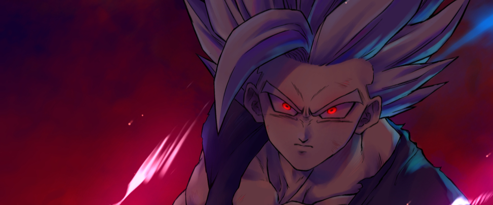

Deepak Kaushal
===============================
### Data Science Aspirant ✨
###
#####   🌍  I'm based in Hoshiarpur, Punjab India
#####  ✉️  You can contact me at [Email](mailto:deepakkaushal7774@gmail.com)
#####   🧠  I'm learning Machine Learning / Artifical Intelligence
#####   🤝  I'm open to collaborating on Interested Projects
#####   ⚡  I'm a Playboy.....Don't Tell Anyone🤫  
#####   💻  Data Science ... My Passion💫
 

## Skills 
 

  
  
  
  
  
  
  
  
  
  
  
  
  
  
  

 

## Socials
 

  
  
  
  
 <a href="https://www.x.com/DeepakKaushal74" target="_blank" rel="noreferrer"> <picture> <source media="(prefers-color-scheme: dark)" srcset="https://raw.githubusercontent.com/danielcranney/readme-generator/main/public/icons/socials/twitter-dark.svg" /> <source media="(prefers-color-scheme: light)" srcset="https://raw.githubusercontent.com/danielcranney/readme-generator/main/public/icons/socials/twitter.svg" />  </picture> </a>

 

## Stats

<table>
<tr>
  <td>
      
  </td>
    <td>
     
    </td>
    <td>
       
    </td>
</tr>    
</table>

    

<table>
<th>ॐ नमः शिवाय ।</th>
</table>
